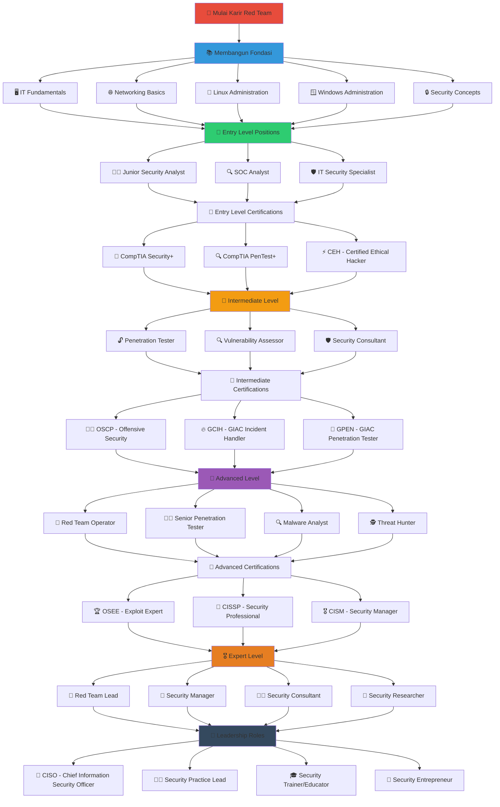

# MATERI_KELAS
REPO PEMBELAJARAN

```mermaid
graph TD
    START[🎯 Mulai Karir Red Team] --> FOUNDATION[📚 Membangun Fondasi]
    
    FOUNDATION --> F1[🖥️ IT Fundamentals]
    FOUNDATION --> F2[🌐 Networking Basics]
    FOUNDATION --> F3[🐧 Linux Administration]
    FOUNDATION --> F4[🪟 Windows Administration]
    FOUNDATION --> F5[🔒 Security Concepts]
    
    F1 --> ENTRY[🚀 Entry Level Positions]
    F2 --> ENTRY
    F3 --> ENTRY
    F4 --> ENTRY
    F5 --> ENTRY
    
    ENTRY --> E1[👨‍💻 Junior Security Analyst]
    ENTRY --> E2[🔍 SOC Analyst]
    ENTRY --> E3[🛡️ IT Security Specialist]
    
    E1 --> CERTS1[📜 Entry Level Certifications]
    E2 --> CERTS1
    E3 --> CERTS1
    
    CERTS1 --> C1[🔰 CompTIA Security+]
    CERTS1 --> C2[🔍 CompTIA PenTest+]
    CERTS1 --> C3[⚡ CEH - Certified Ethical Hacker]
    
    C1 --> INTERMEDIATE[🎯 Intermediate Level]
    C2 --> INTERMEDIATE
    C3 --> INTERMEDIATE
    
    INTERMEDIATE --> I1[🔓 Penetration Tester]
    INTERMEDIATE --> I2[🔍 Vulnerability Assessor]
    INTERMEDIATE --> I3[🛡️ Security Consultant]
    
    I1 --> CERTS2[📜 Intermediate Certifications]
    I2 --> CERTS2
    I3 --> CERTS2
    
    CERTS2 --> C4[🏴‍☠️ OSCP - Offensive Security]
    CERTS2 --> C5[🔥 GCIH - GIAC Incident Handler]
    CERTS2 --> C6[🎯 GPEN - GIAC Penetration Tester]
    
    C4 --> ADVANCED[🚀 Advanced Level]
    C5 --> ADVANCED
    C6 --> ADVANCED
    
    ADVANCED --> A1[🔴 Red Team Operator]
    ADVANCED --> A2[👨‍💼 Senior Penetration Tester]
    ADVANCED --> A3[🔍 Malware Analyst]
    ADVANCED --> A4[🕵️ Threat Hunter]
    
    A1 --> CERTS3[📜 Advanced Certifications]
    A2 --> CERTS3
    A3 --> CERTS3
    A4 --> CERTS3
    
    CERTS3 --> C7[🏆 OSEE - Exploit Expert]
    CERTS3 --> C8[👑 CISSP - Security Professional]
    CERTS3 --> C9[🎖️ CISM - Security Manager]
    
    C7 --> EXPERT[🎖️ Expert Level]
    C8 --> EXPERT
    C9 --> EXPERT
    
    EXPERT --> EX1[👑 Red Team Lead]
    EXPERT --> EX2[🏢 Security Manager]
    EXPERT --> EX3[👨‍🏫 Security Consultant]
    EXPERT --> EX4[🔬 Security Researcher]
    
    EX1 --> LEADERSHIP[🌟 Leadership Roles]
    EX2 --> LEADERSHIP
    EX3 --> LEADERSHIP
    EX4 --> LEADERSHIP
    
    LEADERSHIP --> L1[🏢 CISO - Chief Information Security Officer]
    LEADERSHIP --> L2[👨‍💼 Security Practice Lead]
    LEADERSHIP --> L3[🎓 Security Trainer/Educator]
    LEADERSHIP --> L4[🚀 Security Entrepreneur]
    
    style START fill:#e74c3c
    style FOUNDATION fill:#3498db
    style ENTRY fill:#2ecc71
    style INTERMEDIATE fill:#f39c12
    style ADVANCED fill:#9b59b6
    style EXPERT fill:#e67e22
    style LEADERSHIP fill:#34495e
```
