# 🎯 Red Team Materials - Complete Learning Repository

Repositori lengkap untuk pembelajaran Red Team dan Penetration Testing dalam bahasa Indonesia. Materi ini dirancang untuk memberikan pemahaman komprehensif mulai dari dasar hingga tingkat lanjut.

## 📚 Struktur Materi

### 📋 [Red Team Legal & Ethics](Red-Team-Legal-Ethics.md)
Panduan lengkap tentang aspek legal dan etika dalam penetration testing, termasuk:
- Framework legal dan regulasi
- Pedoman etika profesional
- Dokumentasi dan pelaporan yang diperlukan
- Template kontrak dan authorization

### 🛠️ [Red Team Tools Cheatsheet](Red-Team-Tools-Cheatsheet.md)
Referensi cepat untuk tools penetration testing yang paling umum digunakan:
- Tools reconnaissance dan OSINT
- Web application testing tools
- Network penetration tools
- Password cracking utilities
- Post-exploitation frameworks

### 🏗️ [Red Team Lab Setup](Red-Team-Lab-Setup.md)
Panduan step-by-step untuk membangun lab penetration testing:
- Setup Kali Linux dan tools
- Konfigurasi target Windows dan Linux
- Deployment aplikasi web vulnerable
- Network configuration dan segmentasi

### 📖 [Red Team Pentesting Guide](Red-Team-Pentesting-Guide.md)
Panduan metodologi penetration testing yang komprehensif:
- Metodologi dan framework testing
- Teknik reconnaissance dan enumeration
- Exploitation techniques dan post-exploitation
- Skenario praktis dan case studies

## 🗺️ Flowchart Pembelajaran

### 1. Struktur Materi Lengkap

```mermaid
flowchart TD
    A[🎯 RED TEAM MATERIALS<br/>Complete Learning Path] --> B[📋 Legal & Ethics Foundation]
    A --> C[🛠️ Tools & Techniques]
    A --> D[🏗️ Lab Environment]
    A --> E[📖 Pentesting Guide]
    
    %% Legal & Ethics Branch
    B --> B1[📜 Legal Framework]
    B --> B2[⚖️ Ethical Guidelines]
    B --> B3[📄 Documentation Requirements]
    
    B1 --> B1a[Authorization Requirements]
    B1 --> B1b[Scope Definition]
    B1 --> B1c[Legal Compliance]
    
    B2 --> B2a[Professional Ethics]
    B2 --> B2b[Responsible Disclosure]
    B2 --> B2c[Client Confidentiality]
    
    B3 --> B3a[Engagement Documentation]
    B3 --> B3b[Evidence Handling]
    B3 --> B3c[Report Templates]
    
    %% Tools & Techniques Branch
    C --> C1[🔍 Reconnaissance Tools]
    C --> C2[🌐 Web Application Testing]
    C --> C3[💥 Exploitation Tools]
    C --> C4[🔐 Password Attacks]
    C --> C5[🏃 Post-Exploitation]
    
    C1 --> C1a[Nmap - Network Scanning]
    C1 --> C1b[Masscan - Fast Port Scanner]
    C1 --> C1c[theHarvester - OSINT]
    C1 --> C1d[Recon-ng - Framework]
    
    C2 --> C2a[Burp Suite - Proxy & Scanner]
    C2 --> C2b[OWASP ZAP - Security Scanner]
    C2 --> C2c[SQLMap - SQL Injection]
    C2 --> C2d[Nikto - Web Scanner]
    C2 --> C2e[Gobuster - Directory Enum]
    
    C3 --> C3a[Metasploit Framework]
    C3 --> C3b[Searchsploit - Exploit DB]
    C3 --> C3c[Custom Exploits]
    
    C4 --> C4a[John the Ripper]
    C4 --> C4b[Hashcat - GPU Cracking]
    C4 --> C4c[Hydra - Network Login]
    C4 --> C4d[Medusa - Parallel Login]
    
    C5 --> C5a[Mimikatz - Credential Extraction]
    C5 --> C5b[BloodHound - AD Analysis]
    C5 --> C5c[Empire - Post-Exploit Framework]
    C5 --> C5d[Cobalt Strike Alternative]
    
    %% Lab Environment Branch
    D --> D1[🐧 Kali Linux Setup]
    D --> D2[🪟 Windows Targets]
    D --> D3[🐧 Linux Targets]
    D --> D4[🌐 Web Applications]
    D --> D5[🔧 Network Configuration]
    
    D1 --> D1a[Base Installation]
    D1 --> D1b[Tool Installation]
    D1 --> D1c[Customization]
    
    D2 --> D2a[Windows 10 Vulnerable]
    D2 --> D2b[Windows Server Domain]
    D2 --> D2c[Active Directory Setup]
    
    D3 --> D3a[Metasploitable 2]
    D3 --> D3b[Ubuntu Vulnerable]
    D3 --> D3c[Custom Linux Targets]
    
    D4 --> D4a[DVWA - Web Vulnerabilities]
    D4 --> D4b[WebGoat - OWASP Training]
    D4 --> D4c[Mutillidae II - Multi-vuln]
    D4 --> D4d[bWAPP - Bug Web App]
    
    D5 --> D5a[VMware Network Setup]
    D5 --> D5b[pfSense Firewall]
    D5 --> D5c[Network Segmentation]
    
    %% Pentesting Guide Branch
    E --> E1[🎯 Methodology]
    E --> E2[🔍 Reconnaissance Phase]
    E --> E3[📊 Vulnerability Assessment]
    E --> E4[💥 Exploitation Phase]
    E --> E5[🏃 Post-Exploitation]
    E --> E6[📝 Reporting]
    
    E1 --> E1a[OWASP Testing Guide]
    E1 --> E1b[NIST Framework]
    E1 --> E1c[PTES Standard]
    
    E2 --> E2a[Passive Information Gathering]
    E2 --> E2b[Active Information Gathering]
    E2 --> E2c[Service Enumeration]
    
    E3 --> E3a[Automated Scanning]
    E3 --> E3b[Manual Testing]
    E3 --> E3c[Vulnerability Validation]
    
    E4 --> E4a[Web Application Exploits]
    E4 --> E4b[Network Service Exploits]
    E4 --> E4c[Client-Side Attacks]
    
    E5 --> E5a[Privilege Escalation]
    E5 --> E5b[Lateral Movement]
    E5 --> E5c[Persistence Mechanisms]
    E5 --> E5d[Data Exfiltration]
    
    E6 --> E6a[Executive Summary]
    E6 --> E6b[Technical Details]
    E6 --> E6c[Remediation Recommendations]
    
    %% Practical Scenarios
    E --> E7[🎯 Practical Scenarios]
    E7 --> E7a[Web App Pentest - DVWA]
    E7 --> E7b[Network Pentest - Internal]
    E7 --> E7c[Active Directory Attack]
    E7 --> E7d[Full Red Team Exercise]
    
    %% Styling
    classDef mainNode fill:#ff6b6b,stroke:#333,stroke-width:3px,color:#fff
    classDef categoryNode fill:#4ecdc4,stroke:#333,stroke-width:2px,color:#fff
    classDef subNode fill:#45b7d1,stroke:#333,stroke-width:1px,color:#fff
    classDef toolNode fill:#96ceb4,stroke:#333,stroke-width:1px,color:#333
    classDef scenarioNode fill:#feca57,stroke:#333,stroke-width:2px,color:#333
    
    class A mainNode
    class B,C,D,E categoryNode
    class B1,B2,B3,C1,C2,C3,C4,C5,D1,D2,D3,D4,D5,E1,E2,E3,E4,E5,E6 subNode
    class B1a,B1b,B1c,B2a,B2b,B2c,B3a,B3b,B3c,C1a,C1b,C1c,C1d,C2a,C2b,C2c,C2d,C2e,C3a,C3b,C3c,C4a,C4b,C4c,C4d,C5a,C5b,C5c,C5d,D1a,D1b,D1c,D2a,D2b,D2c,D3a,D3b,D3c,D4a,D4b,D4c,D4d,D5a,D5b,D5c,E1a,E1b,E1c,E2a,E2b,E2c,E3a,E3b,E3c,E4a,E4b,E4c,E5a,E5b,E5c,E5d,E6a,E6b,E6c toolNode
    class E7,E7a,E7b,E7c,E7d scenarioNode
```

### 2. Alur Pembelajaran (Learning Path)

```mermaid
flowchart TD
    START([🚀 START: Red Team Journey]) --> LEGAL{📋 Legal & Ethics<br/>Foundation Complete?}
    
    LEGAL -->|No| LEGAL_STUDY[📖 Study Legal Framework<br/>• Authorization Requirements<br/>• Ethical Guidelines<br/>• Documentation Standards]
    LEGAL_STUDY --> LEGAL
    
    LEGAL -->|Yes| LAB_SETUP{🏗️ Lab Environment<br/>Ready?}
    
    LAB_SETUP -->|No| LAB_BUILD[🔧 Build Lab Environment<br/>• Install Kali Linux<br/>• Setup Target VMs<br/>• Configure Network<br/>• Deploy Web Apps]
    LAB_BUILD --> LAB_SETUP
    
    LAB_SETUP -->|Yes| TOOLS_READY{🛠️ Tools Mastery<br/>Level?}
    
    TOOLS_READY -->|Beginner| BASIC_TOOLS[🔰 Learn Basic Tools<br/>• Nmap scanning<br/>• Burp Suite basics<br/>• Metasploit fundamentals<br/>• John the Ripper]
    
    TOOLS_READY -->|Intermediate| ADV_TOOLS[⚡ Advanced Tools<br/>• Custom exploits<br/>• BloodHound AD analysis<br/>• Advanced post-exploitation<br/>• Evasion techniques]
    
    TOOLS_READY -->|Expert| SCENARIO_SELECT[🎯 Select Scenario]
    
    BASIC_TOOLS --> PRACTICE1[💻 Practice Session 1<br/>• DVWA Web App Testing<br/>• Basic SQL Injection<br/>• XSS Exploitation]
    
    PRACTICE1 --> ASSESS1{📊 Self Assessment<br/>Comfortable with basics?}
    ASSESS1 -->|No| BASIC_TOOLS
    ASSESS1 -->|Yes| ADV_TOOLS
    
    ADV_TOOLS --> PRACTICE2[💻 Practice Session 2<br/>• Network Penetration<br/>• Privilege Escalation<br/>• Lateral Movement]
    
    PRACTICE2 --> ASSESS2{📊 Self Assessment<br/>Ready for scenarios?}
    ASSESS2 -->|No| ADV_TOOLS
    ASSESS2 -->|Yes| SCENARIO_SELECT
    
    SCENARIO_SELECT --> SCENARIO1[🌐 Scenario 1: Web App Pentest<br/>• DVWA Complete Testing<br/>• All OWASP Top 10<br/>• Report Generation]
    
    SCENARIO_SELECT --> SCENARIO2[🖥️ Scenario 2: Network Pentest<br/>• Internal Network<br/>• Service Enumeration<br/>• Exploitation Chain]
    
    SCENARIO_SELECT --> SCENARIO3[🏢 Scenario 3: AD Attack<br/>• Domain Enumeration<br/>• Kerberoasting<br/>• Domain Compromise]
    
    SCENARIO_SELECT --> SCENARIO4[🎯 Scenario 4: Full Red Team<br/>• External Recon<br/>• Initial Access<br/>• Complete Compromise]
    
    SCENARIO1 --> REPORT1[📝 Generate Report<br/>• Executive Summary<br/>• Technical Details<br/>• Remediation Steps]
    
    SCENARIO2 --> REPORT2[📝 Generate Report<br/>• Network Findings<br/>• Risk Assessment<br/>• Security Recommendations]
    
    SCENARIO3 --> REPORT3[📝 Generate Report<br/>• AD Vulnerabilities<br/>• Attack Paths<br/>• Hardening Guide]
    
    SCENARIO4 --> REPORT4[📝 Generate Report<br/>• Complete Assessment<br/>• Business Impact<br/>• Strategic Recommendations]
    
    REPORT1 --> REVIEW{🔍 Peer Review<br/>& Feedback}
    REPORT2 --> REVIEW
    REPORT3 --> REVIEW
    REPORT4 --> REVIEW
    
    REVIEW -->|Needs Improvement| IMPROVE[📈 Improve Skills<br/>• Study gaps<br/>• Practice more<br/>• Seek mentorship]
    IMPROVE --> SCENARIO_SELECT
    
    REVIEW -->|Satisfactory| ADVANCE{🚀 Ready to Advance?}
    
    ADVANCE -->|More Practice| SCENARIO_SELECT
    ADVANCE -->|Professional Level| CERT[🏆 Consider Certifications<br/>• OSCP<br/>• OSCE<br/>• GPEN<br/>• CEH]
    
    CERT --> CAREER[💼 Career Opportunities<br/>• Penetration Tester<br/>• Red Team Operator<br/>• Security Consultant<br/>• Bug Bounty Hunter]
    
    CAREER --> CONTINUOUS[🔄 Continuous Learning<br/>• Stay updated<br/>• New techniques<br/>• Community involvement<br/>• Knowledge sharing]
    
    %% Styling
    classDef startNode fill:#ff6b6b,stroke:#333,stroke-width:3px,color:#fff
    classDef decisionNode fill:#feca57,stroke:#333,stroke-width:2px,color:#333
    classDef actionNode fill:#4ecdc4,stroke:#333,stroke-width:2px,color:#fff
    classDef practiceNode fill:#45b7d1,stroke:#333,stroke-width:2px,color:#fff
    classDef scenarioNode fill:#96ceb4,stroke:#333,stroke-width:2px,color:#333
    classDef reportNode fill:#a8e6cf,stroke:#333,stroke-width:2px,color:#333
    classDef endNode fill:#ff8b94,stroke:#333,stroke-width:3px,color:#fff
    
    class START,CAREER,CONTINUOUS startNode
    class LEGAL,LAB_SETUP,TOOLS_READY,ASSESS1,ASSESS2,REVIEW,ADVANCE decisionNode
    class LEGAL_STUDY,LAB_BUILD,BASIC_TOOLS,ADV_TOOLS,IMPROVE,CERT actionNode
    class PRACTICE1,PRACTICE2 practiceNode
    class SCENARIO_SELECT,SCENARIO1,SCENARIO2,SCENARIO3,SCENARIO4 scenarioNode
    class REPORT1,REPORT2,REPORT3,REPORT4 reportNode
```

### 3. Metodologi Penetration Testing

```mermaid
flowchart TD
    START([🎯 Penetration Testing<br/>Methodology]) --> PLANNING[📋 Planning & Preparation<br/>• Define scope<br/>• Get authorization<br/>• Prepare tools<br/>• Set timeline]

    PLANNING --> RECON[🔍 Reconnaissance<br/>Information Gathering]

    RECON --> PASSIVE[🕵️ Passive Reconnaissance<br/>• OSINT gathering<br/>• DNS enumeration<br/>• Social media research<br/>• Public records]

    RECON --> ACTIVE[🎯 Active Reconnaissance<br/>• Network scanning<br/>• Port enumeration<br/>• Service detection<br/>• Banner grabbing]

    PASSIVE --> ANALYSIS1[📊 Analysis Phase 1<br/>• Compile information<br/>• Identify targets<br/>• Map attack surface]
    ACTIVE --> ANALYSIS1

    ANALYSIS1 --> SCANNING[🔎 Vulnerability Scanning<br/>• Automated scanners<br/>• Manual testing<br/>• Service enumeration<br/>• Version detection]

    SCANNING --> VULN_ASSESS[📈 Vulnerability Assessment<br/>• Categorize findings<br/>• Risk assessment<br/>• Prioritize targets<br/>• Validate vulnerabilities]

    VULN_ASSESS --> EXPLOIT_PLAN[💡 Exploitation Planning<br/>• Select attack vectors<br/>• Prepare exploits<br/>• Plan attack chain<br/>• Consider stealth]

    EXPLOIT_PLAN --> EXPLOITATION[💥 Exploitation Phase]

    EXPLOITATION --> WEB_EXPLOIT[🌐 Web Application Exploits<br/>• SQL Injection<br/>• XSS attacks<br/>• CSRF<br/>• File upload vulns]

    EXPLOITATION --> NETWORK_EXPLOIT[🖥️ Network Service Exploits<br/>• Buffer overflows<br/>• Service misconfigurations<br/>• Default credentials<br/>• Protocol attacks]

    EXPLOITATION --> CLIENT_EXPLOIT[👤 Client-Side Attacks<br/>• Phishing campaigns<br/>• Malicious documents<br/>• Browser exploits<br/>• Social engineering]

    WEB_EXPLOIT --> ACCESS_CHECK{🚪 Initial Access<br/>Gained?}
    NETWORK_EXPLOIT --> ACCESS_CHECK
    CLIENT_EXPLOIT --> ACCESS_CHECK

    ACCESS_CHECK -->|No| EXPLOIT_RETRY[🔄 Retry Exploitation<br/>• Try different vectors<br/>• Modify approach<br/>• Use alternative tools]
    EXPLOIT_RETRY --> EXPLOITATION

    ACCESS_CHECK -->|Yes| POST_EXPLOIT[🏃 Post-Exploitation<br/>Phase]

    POST_EXPLOIT --> PRIV_ESC[⬆️ Privilege Escalation<br/>• Local exploits<br/>• Misconfigurations<br/>• Weak permissions<br/>• Service accounts]

    POST_EXPLOIT --> LATERAL[↔️ Lateral Movement<br/>• Network enumeration<br/>• Credential reuse<br/>• Pass-the-hash<br/>• Remote services]

    POST_EXPLOIT --> PERSISTENCE[🔒 Persistence<br/>• Backdoors<br/>• Scheduled tasks<br/>• Registry modifications<br/>• Service installation]

    PRIV_ESC --> DATA_GATHER[📦 Data Gathering<br/>• Sensitive files<br/>• Database access<br/>• Credential harvesting<br/>• System information]
    LATERAL --> DATA_GATHER
    PERSISTENCE --> DATA_GATHER

    DATA_GATHER --> MAINTAIN_ACCESS{🔐 Maintain Access<br/>Required?}

    MAINTAIN_ACCESS -->|Yes| STEALTH[👻 Stealth Operations<br/>• Log cleaning<br/>• AV evasion<br/>• Traffic obfuscation<br/>• Timestomping]

    MAINTAIN_ACCESS -->|No| CLEANUP[🧹 Cleanup Phase<br/>• Remove artifacts<br/>• Close backdoors<br/>• Restore settings<br/>• Clear logs]

    STEALTH --> OBJECTIVES{🎯 Objectives<br/>Complete?}

    OBJECTIVES -->|No| POST_EXPLOIT
    OBJECTIVES -->|Yes| CLEANUP

    CLEANUP --> DOCUMENTATION[📝 Documentation<br/>• Screenshot evidence<br/>• Command logs<br/>• Vulnerability details<br/>• Impact assessment]

    DOCUMENTATION --> REPORTING[📊 Report Generation]

    REPORTING --> EXEC_SUMMARY[👔 Executive Summary<br/>• Business impact<br/>• Risk overview<br/>• Key findings<br/>• Recommendations]

    REPORTING --> TECH_DETAILS[🔧 Technical Details<br/>• Vulnerability descriptions<br/>• Exploitation steps<br/>• Evidence screenshots<br/>• Code snippets]

    REPORTING --> REMEDIATION[🛠️ Remediation Guide<br/>• Fix procedures<br/>• Configuration changes<br/>• Patch requirements<br/>• Best practices]

    EXEC_SUMMARY --> FINAL_REPORT[📋 Final Report<br/>Compilation]
    TECH_DETAILS --> FINAL_REPORT
    REMEDIATION --> FINAL_REPORT

    FINAL_REPORT --> PRESENTATION[🎤 Client Presentation<br/>• Findings walkthrough<br/>• Q&A session<br/>• Remediation discussion<br/>• Timeline planning]

    PRESENTATION --> RETEST{🔄 Retest Required?}

    RETEST -->|Yes| RETEST_PHASE[✅ Retest Phase<br/>• Verify fixes<br/>• Test new configurations<br/>• Confirm remediation<br/>• Update report]

    RETEST_PHASE --> FINAL_SIGN_OFF[✅ Final Sign-off<br/>• Client approval<br/>• Project closure<br/>• Lessons learned<br/>• Archive materials]

    RETEST -->|No| FINAL_SIGN_OFF

    FINAL_SIGN_OFF --> END([🏁 Project Complete])

    %% Styling
    classDef startEndNode fill:#ff6b6b,stroke:#333,stroke-width:3px,color:#fff
    classDef phaseNode fill:#4ecdc4,stroke:#333,stroke-width:2px,color:#fff
    classDef actionNode fill:#45b7d1,stroke:#333,stroke-width:2px,color:#fff
    classDef decisionNode fill:#feca57,stroke:#333,stroke-width:2px,color:#333
    classDef exploitNode fill:#ff8b94,stroke:#333,stroke-width:2px,color:#fff
    classDef reportNode fill:#96ceb4,stroke:#333,stroke-width:2px,color:#333

    class START,END startEndNode
    class PLANNING,RECON,SCANNING,EXPLOITATION,POST_EXPLOIT,REPORTING phaseNode
    class PASSIVE,ACTIVE,ANALYSIS1,VULN_ASSESS,EXPLOIT_PLAN,PRIV_ESC,LATERAL,PERSISTENCE,DATA_GATHER,STEALTH,CLEANUP,DOCUMENTATION,RETEST_PHASE,FINAL_SIGN_OFF actionNode
    class ACCESS_CHECK,MAINTAIN_ACCESS,OBJECTIVES,RETEST decisionNode
    class WEB_EXPLOIT,NETWORK_EXPLOIT,CLIENT_EXPLOIT,EXPLOIT_RETRY exploitNode
    class EXEC_SUMMARY,TECH_DETAILS,REMEDIATION,FINAL_REPORT,PRESENTATION reportNode
```

## 🚀 Cara Menggunakan Repository Ini

### 1. **Mulai dengan Legal & Ethics** 📋
Sebelum memulai aktivitas penetration testing, pastikan Anda memahami aspek legal dan etika:
- Baca [Red Team Legal & Ethics](Red-Team-Legal-Ethics.md)
- Pahami requirement authorization dan dokumentasi
- Siapkan template kontrak dan scope definition

### 2. **Setup Lab Environment** 🏗️
Bangun environment testing yang aman dan terisolasi:
- Ikuti panduan [Red Team Lab Setup](Red-Team-Lab-Setup.md)
- Install dan konfigurasi Kali Linux
- Deploy target systems (Windows, Linux, Web Apps)
- Setup network segmentation

### 3. **Pelajari Tools & Techniques** 🛠️
Kuasai tools penetration testing yang essential:
- Gunakan [Red Team Tools Cheatsheet](Red-Team-Tools-Cheatsheet.md) sebagai referensi
- Mulai dengan tools dasar (Nmap, Burp Suite, Metasploit)
- Lanjutkan ke tools advanced sesuai kebutuhan

### 4. **Praktik dengan Metodologi** 📖
Terapkan metodologi penetration testing yang terstruktur:
- Ikuti panduan [Red Team Pentesting Guide](Red-Team-Pentesting-Guide.md)
- Mulai dengan skenario sederhana (DVWA)
- Tingkatkan kompleksitas secara bertahap

### 5. **Dokumentasi dan Reporting** 📝
Selalu dokumentasikan setiap aktivitas testing:
- Screenshot evidence dan command logs
- Buat laporan yang komprehensif
- Include remediation recommendations

## 🎯 Target Pembelajaran

Setelah menyelesaikan semua materi dalam repository ini, Anda diharapkan dapat:

- ✅ Memahami aspek legal dan etika penetration testing
- ✅ Membangun dan mengelola lab environment sendiri
- ✅ Menggunakan tools penetration testing dengan efektif
- ✅ Menerapkan metodologi testing yang terstruktur
- ✅ Melakukan web application dan network penetration testing
- ✅ Mengeksploitasi vulnerabilities dengan bertanggung jawab
- ✅ Membuat laporan penetration testing yang profesional
- ✅ Memahami teknik post-exploitation dan lateral movement

## 📚 Sumber Referensi Tambahan

- [OWASP Testing Guide](https://owasp.org/www-project-web-security-testing-guide/)
- [NIST Cybersecurity Framework](https://www.nist.gov/cyberframework)
- [PTES - Penetration Testing Execution Standard](http://www.pentest-standard.org/)
- [Kali Linux Documentation](https://www.kali.org/docs/)
- [Metasploit Unleashed](https://www.metasploit.com/unleashed/)

## ⚠️ Disclaimer

Materi dalam repository ini disediakan untuk tujuan **EDUKASI dan PEMBELAJARAN** saja. Penggunaan teknik dan tools yang dijelaskan harus dilakukan dengan:

1. **Authorization yang sah** dari pemilik sistem
2. **Lingkungan testing yang terisolasi**
3. **Tujuan yang legitimate dan legal**
4. **Tanggung jawab penuh** atas konsekuensi penggunaan

Penulis tidak bertanggung jawab atas penyalahgunaan informasi dalam repository ini.

## 🤝 Kontribusi

Kontribusi untuk meningkatkan kualitas materi sangat diterima! Silakan:
- Fork repository ini
- Buat branch untuk perubahan Anda
- Submit pull request dengan deskripsi yang jelas
- Ikuti format dan style yang sudah ada

## 📞 Kontak

Untuk pertanyaan, saran, atau diskusi lebih lanjut, silakan buat issue di repository ini.

---

**Happy Learning & Stay Ethical!** 🎯🔒
